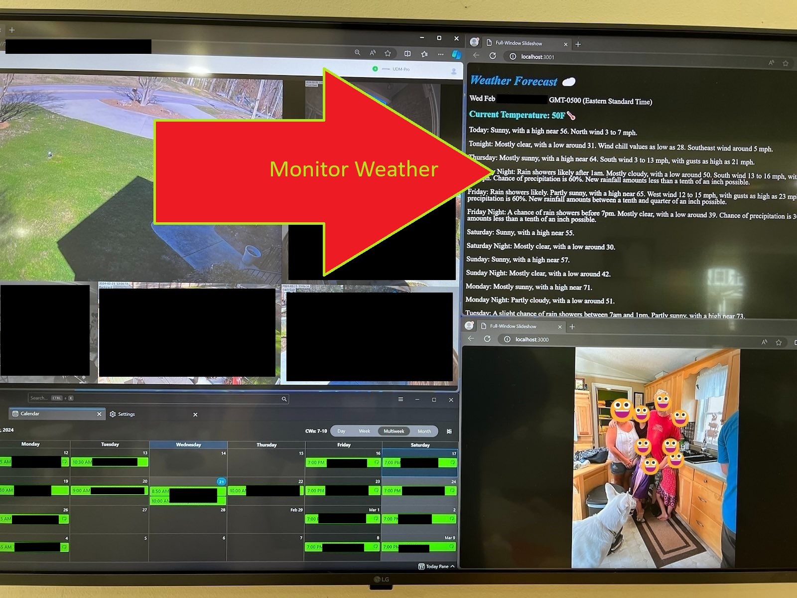
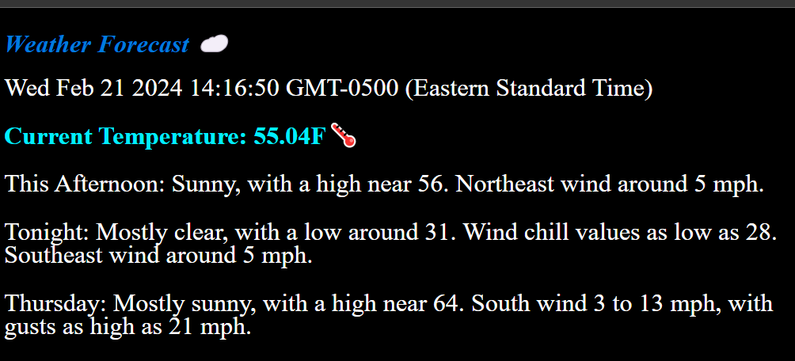
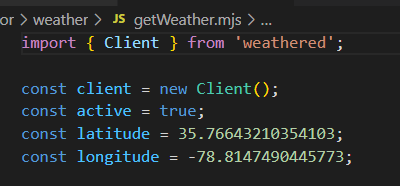

# Monitor Weather System 🌡️
This is a simple project to display the local weather on a monitor 💻 which continuously refreshes.  I use this on my families information center which presents in our kitchen/living room area.

This would probably be useful in a bar, or some other venue that would like to show the weather.  If you would like to show a slideshow I have a repo for that as well [https://github.com/RamboRogers/slideshow]. 

The Weather Montior is powered by the National Weather Service funded by US Federal Tax dollars; I don't know if this will work outside of the USA🌍.





## Features

* Runs in a browser window. 💻
* Shows the current temperature based on location. 🌎
* Shows the 7 days forecast based on location. 📅
* Shows ANY weather alerts by location. ⚠️
  
## Getting Started 🏃

**Run It!** 🚀
1. Install nodejs [https://nodejs.org/]
2. Clone the repo 

    ``` git clone https://github.com/RamboRogers/weathermonitor ```

3. Enter the directory

    ``` cd weathermonitor ```

3. Install dependencies 

    ``` npm install ```

4. Run it, this opens a browser window to the app. 

     ``` npm start ```

    >_Note: The terminal window MUST remain open, it is a live application and weather cannot refresh without it!_


5. Update your location by editing the "getWeather.mjs" file by updating your longitude and latitude (you can get this off google maps).

    


**Software:**

* Uses nodejs [https://nodejs.org/en]
* Utilizes weather api [https://www.weather.gov/documentation/services-web-api]
* Express [https://github.com/expressjs/express]
* Weathered [https://github.com/JasonSanford/weathered]


## Code

The code is here: [https://github.com/RamboRogers/weathermonitor]

## License

This project and it's code are all owned by Matthew Roghers, all rights reserved by owner.

## Author

Victor Rogers & Matthew Rogers

## Contact

matt@rogers.uno
